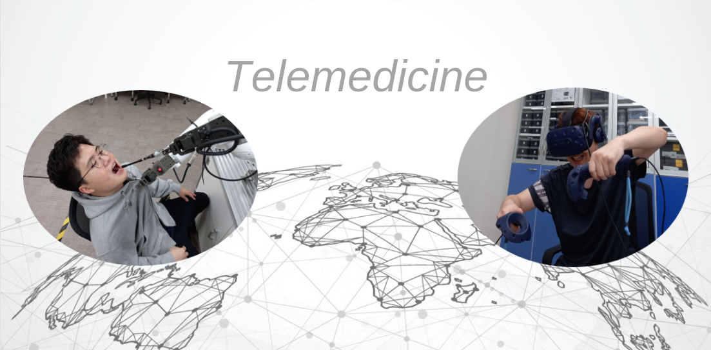
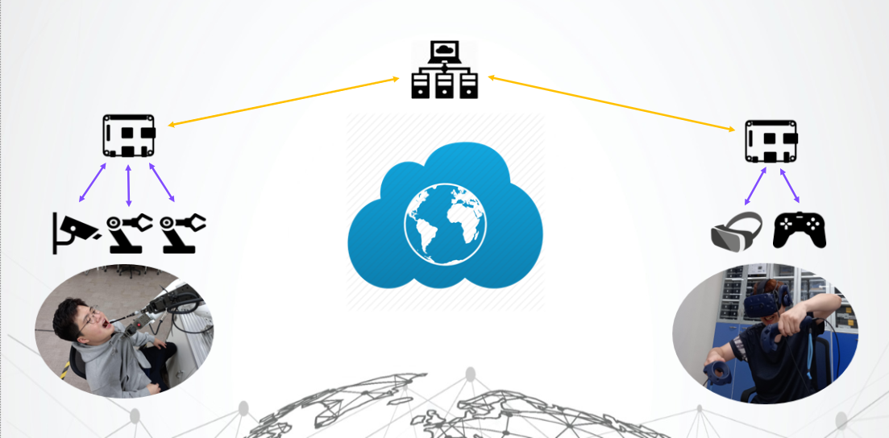

# VR_Telemedicine
협동로봇과 VR기술로 원격의료 시스템 개발

## 개요

* 1 단계 : 협동로봇 제어 확립
* 2 단계 : 협동로봇 정밀 제어
* 3 단계 : 협동로봇 제어 응용
* 4 단계 : VR콘솔 및 기타 필드 장비의 실시간 데이터 추출
* 5 단계 : VR콘솔과 협동로봇 연동
* (궁극적인 방향) 6 단계 : 원격제어 데이터로 AI 모델 생성

## 개발의의
* 원격의료 
* 협동로봇의 고등응용으로 실력 향상

## 환경
* **필드**
    * 협동로봇 : UR3e(Universal Robts), Indy-7(Neuromeka)
* **베이스**
    * VR콘솔 : VIVE-pro-eye(HTC)
* **기타장비**
    * MCU : Disco-L475VG(STM), NUCLEO​-F429ZI​(STM)
    * 오실로스코프 : TOL-13929​(디질런트)
    * Depth Camera : D435(RealSense)

## 상태
* **진행** : 4 단계에서 무기한 중지
    * 사유 : 환경변화
* **기간** : 2022-08-17 ~ 2023-03-01
* **인원** : 1명
* **결과** 
    * ### 1 단계
        | 힘제어 | 팔레타이징 | 플레인 제어 | 
        | --- | --- | --- |
        |  |  |  |

    * ### 2 단계
        | 외부장치(초음파센서)와 연동 | 수치 기반 제어 | 로봇간 연동 |
        | --- | --- | --- |
        |  |  |  |

    * ### 3 단계
        | 인형뽑기 | 사인파(sine wave) 그리기 |
        | --- | --- |
        |  |  |
    
    * ### 4 단계
        | Depth Camera 에 AI 연동 | VR데이터 추출 |
        | --- | --- |
        |  | 진행 중 중지... |

